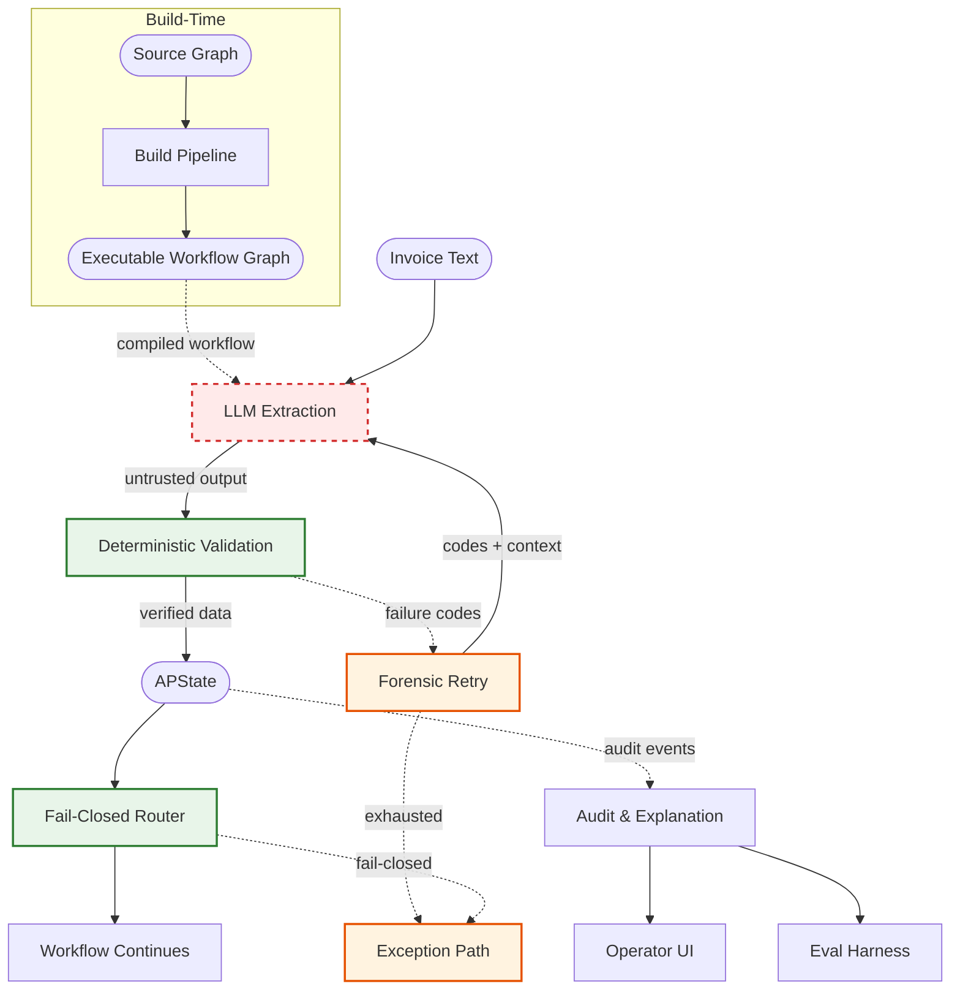

# Process Extraction Kernel

A deterministic AP invoice-processing kernel. A mined process graph is patched
with business-logic guardrails, normalized through 17 idempotent repair passes,
validated by a structural linter, and compiled to a LangGraph state machine.
LLM calls are constrained to minimized output to reduce degradation, used for semantic extraction
(see `src/agent/nodes.py: execute_node`); all routing decisions are made by an
eval-free condition DSL and a 2-phase deterministic router. Extraction output is
cross-checked against raw invoice text by an evidence-backed verifier and an
arithmetic consistency layer. A 126-invoice gold dataset with mock and live
evaluation modes drives continuous accuracy tracking, and a Gemini-powered
meta-agent can autonomously patch failures and open PRs.

---

## Quick Links

- [Architecture Overview](docs/ARCHITECTURE_OVERVIEW.md) — scannable high-level diagram
- [Detailed Technical Diagram](docs/ARCHITECTURE_DIAGRAM.md) — trust boundaries, router phases, observability layers
- [Architecture Docs](docs/ARCHITECTURE.md) — module-level reference
- [Evaluation Docs](docs/EVALUATION.md) — gold dataset, evidence grounding, metrics

---

## Architecture at a Glance

High-level view of the deterministic AI workflow: untrusted extraction, deterministic validation, fail-closed routing, and operator/eval visibility.

> For the detailed technical view, see [ARCHITECTURE_DIAGRAM.md](docs/ARCHITECTURE_DIAGRAM.md).
> For module-level documentation, see [ARCHITECTURE.md](docs/ARCHITECTURE.md).



| Visual cue | Meaning |
|------------|---------|
| Red dashed border | Untrusted AI output |
| Green border | Deterministic control (validation, routing) |
| Orange border | Failure handling (retry, fail-closed exits) |
| Dashed arrows | Failure paths or observability flows |

Cross-cutting concerns such as PolicyConfig, Schema Contracts, and the internal validation layers are shown in the [detailed technical diagram](docs/ARCHITECTURE_DIAGRAM.md).

---

## What the System Does

The system combines deterministic extraction verification, routing, and arithmetic
checks with a structured interpretation layer for operator-facing explanation.

1. **Ingest** raw invoice text (paste, upload, or test example)
2. **Extract and verify** fields via LLM, cross-checked against source text evidence
3. **Route deterministically** through a patched process graph using an eval-free condition DSL
4. **Validate arithmetic** consistency (subtotal + tax + fees = total, tax rate coherence)
5. **Emit typed audit events** at every step, parsed into immutable `ParsedAuditLog`
6. **Build structured explanations** via `ExplanationReport` (outcome classification, extraction, routing, match, exception, retry, arithmetic)
7. **Render operator-facing UI** with status banners, operator review synthesis, failure drill-down, and full audit trail

---

## Core Guarantees

| Guarantee | Enforcement |
|-----------|-------------|
| **Deterministic routing** -- no LLM at the decision layer | `src/agent/router.py: analyze_routing` evaluates DSL predicates, never calls an LLM |
| **Evidence-backed extraction** -- verifier cross-checks LLM output against raw text | `src/verifier.py: verify_extraction` returns failure codes + provenance |
| **Fail-closed** -- ambiguous or missing routes become exception stations | `src/agent/router.py: route_edge` resolves to exception sinks; `src/linter.py: assert_graph_valid` blocks compilation on errors |
| **No eval/exec in conditions** -- explicit tokenizer + AST | `src/conditions.py: parse_condition` produces `Comparison` / `Conjunction` AST nodes |
| **Full audit trail** -- per-step typed audit log on every invoice | `src/agent/state.py: APState.audit_log` accumulates via `Annotated[list, operator.add]`; parsed by `src/audit_parser.py` |

---

## Architecture Overview

| Layer | Module | Description |
|-------|--------|-------------|
| **Normalization** | `src/normalize_graph.py` | 17 idempotent repair passes: fix artifacts, canonical keys, edge conditions, gateways, exception nodes, deduplication |
| **Condition DSL** | `src/conditions.py` | Eval-free grammar: `comparison (AND comparison)*`; tokenizer -> AST (`Comparison` / `Conjunction`) -> compiled predicate |
| **Graph Linter** | `src/linter.py` + `src/invariants.py` | Sections A-E: referential integrity, actor/artifact checks, gateway semantics, decision consistency, structural invariants |
| **LangGraph Agent** | `src/agent/compiler.py` | Compiles patched JSON -> `StateGraph`; calls `assert_graph_valid`, builds station map for router |
| **Deterministic Router** | `src/agent/router.py` | Strict 2-phase: conditional edges first, unconditional fallback; >1 match -> AMBIGUOUS_ROUTE station; 0 matches -> NO_ROUTE station |
| **Node Executors** | `src/agent/nodes.py` | ENTER_RECORD (LLM extraction), CRITIC_RETRY (forensic re-extraction), VALIDATE_FIELDS (LLM validation), ROUTE_FOR_REVIEW (structured audit + exception status) |
| **Evidence Verifier** | `src/verifier.py` | Cross-checks extracted fields (vendor, amount, has_po, invoice_date, tax_amount) against raw invoice text; returns failure codes + provenance metadata |
| **Arithmetic Checks** | `src/arithmetic.py` | Pure source-text cross-checks: subtotal + tax + fees = total, tax rate * subtotal = tax |
| **Exception Stations** | `patch_logic.py` | 4 fail-closed ROUTE_FOR_REVIEW nodes: bad_extraction, unmodeled_gate, ambiguous_route, no_route |
| **Unmodeled Logger** | `src/unmodeled.py` | JSONL logger for unmodeled routing events (never logs raw_text for privacy) |
| **Audit Parser** | `src/audit_parser.py` | Single-pass typed parser: 14 frozen dataclass entry types -> immutable `ParsedAuditLog` |
| **Explanation Layer** | `src/explanation.py` | `build_explanation(parsed) -> ExplanationReport` with optional structured components + `OutcomeClassification` |
| **Verifier Registry** | `src/verifier_registry.py` | Registry-backed field validation; marks invoice_date and tax_amount as optional (skipped when absent) |
| **Schema Validator** | `src/schema_validator.py` | Runtime JSON Schema gates at extraction emission points; rejects payloads with unexpected fields |
| **Policy Layer** | `src/policy.py` | Frozen `PolicyConfig` centralizing approval threshold, PO mode, required fields, and exception station intents |
| **Data Contracts** | `src/contracts.py` | TypedDict shape definitions for extraction payloads, provenance reports, evidence quality tiers |

### Architecture Flow

```
Raw invoice text
  -> LLM extraction + structural validation (ENTER_RECORD)
  -> Evidence verifier (cross-check against source text)
  -> Arithmetic consistency checks (total_sum, tax_rate)
  -> Deterministic routing (eval-free DSL, 2-phase router)
  -> Typed audit event emission at every step
  -> ParsedAuditLog (immutable, single-pass)
  -> ExplanationReport (structured interpretation)
  -> Streamlit operator UI / session history
```

---

## Repository Structure

```
process-extraction-kernel/
+-- app.py                  # Streamlit UI entry point
+-- run_agent.py            # Single invoice CLI runner
+-- batch_runner.py         # Batch processing runner
+-- patch_logic.py          # Graph patching + normalization orchestration
+-- eval_runner.py          # Evaluation harness (mock & live modes)
+-- eval_triage.py          # Failure triage + action plans
+-- eval_audit.py           # Audit layer for evidence trace data
+-- eval_variance.py        # Variance analysis across runs
+-- src/
|   +-- agent/
|   |   +-- compiler.py     # JSON -> LangGraph compiler
|   |   +-- router.py       # 2-phase deterministic router
|   |   +-- nodes.py        # Node executors (ENTER_RECORD, CRITIC_RETRY, VALIDATE_FIELDS, ROUTE_FOR_REVIEW)
|   |   +-- state.py        # APState definition (extraction, provenance, audit_log)
|   +-- conditions.py       # Eval-free condition DSL (tokenizer, AST, compiler)
|   +-- linter.py           # Graph linter (sections A-E)
|   +-- invariants.py       # Structural invariant checks
|   +-- normalize_graph.py  # 17 idempotent repair passes
|   +-- verifier.py         # Evidence-backed extraction verifier (5 fields)
|   +-- verifier_registry.py # Registry-backed field validation (optional field support)
|   +-- schema_validator.py # Runtime JSON Schema gates for extraction payloads
|   +-- arithmetic.py       # Source-text arithmetic consistency checks
|   +-- audit_parser.py     # Canonical typed audit log parser
|   +-- explanation.py      # Structured explanation builder (ExplanationReport)
|   +-- contracts.py        # TypedDict shape definitions + evidence quality tiers
|   +-- policy.py           # Frozen PolicyConfig (thresholds, modes, required fields)
|   +-- ontology.py         # Literal types, status sets, action/decision ontology
|   +-- unmodeled.py        # JSONL logger for unmodeled routing events
|   +-- extract.py          # LLM extraction pipeline
|   +-- canonicalize.py     # Node lookup by canonical key
|   +-- models.py           # Data models (ProcessDoc, Node, Edge, Action, Decision)
|   +-- ui_audit.py         # Legacy audit event extractors
|   +-- gap_analyzer.py     # Gap analysis reporting
|   +-- ...                 # visualizer, benchmarker, calibrator, monitor, etc.
+-- scripts/
|   +-- auto_optimizer.py        # Gemini meta-agent (triage -> patch -> test -> PR)
|   +-- generate_synthetic_batch.py  # Procedural invoice generator + OCR noise
|   +-- scaffold_invoice.py      # Test case stub generator
|   +-- check_dataset_quotas.py  # Stratified coverage enforcement
|   +-- fix_graph.py             # Graph repair utility
|   +-- qa_eval.sh / qa_eval.ps1 # QA runner (tests + eval)
|   +-- run_all.ps1              # Full system runner
+-- tests/                  # 1,589 passing tests (pytest, no LLM needed)
+-- datasets/
|   +-- expected.jsonl      # 126 gold records
|   +-- schema.md           # JSONL schema + evidence grounding rules
|   +-- gold_invoices/      # 126 invoice text files
+-- schema/                 # JSON Schema contracts (data + audit events)
+-- outputs/                # Patched graphs, traces, visualizations
+-- docs/                   # Architecture, history, evaluation docs
+-- data/                   # Analytics DB, example documents
+-- .github/workflows/      # CI/CD (qa-eval.yml)
```

### Primary Entrypoints

| Entrypoint | Purpose | Requires LLM? |
|------------|---------|---------------|
| `app.py` | Streamlit web UI for interactive invoice processing | Yes (Ollama) |
| `run_agent.py` | Single invoice CLI runner for manual testing | Yes (Ollama) |
| `batch_runner.py` | Batch processing with 4 mock invoices | Yes (Ollama) |
| `eval_runner.py` | Evaluation harness (mock and live modes) | Mock: No / Live: Yes |
| `scripts/auto_optimizer.py` | Gemini meta-agent for autonomous patching | Yes (Gemini API) |

---

## Setup & Installation

```bash
# 1. Create virtual environment
python -m venv .venv && .venv\Scripts\activate   # Windows
# python -m venv .venv && source .venv/bin/activate  # macOS/Linux

# 2. Install dependencies
pip install -r requirements.txt

# 3. Start Ollama (needed for live LLM mode and UI)
ollama pull gemma3:12b && ollama serve
```

---

## Running the App

```bash
# Launch the Streamlit UI (requires Ollama)
streamlit run app.py

# Process a single invoice from CLI (requires Ollama)
python run_agent.py

# Generate patched graph (no LLM needed)
python patch_logic.py
```

---

## Running Tests

```bash
# Run full test suite (no LLM needed)
python -m pytest tests/ -q

# Run a specific test file
python -m pytest tests/test_explanation.py -v

# Run full QA check (tests + eval, no LLM needed)
bash scripts/qa_eval.sh          # or: pwsh scripts/qa_eval.ps1
```

All tests are pure Python with mocked LLM boundaries. No Ollama or external services required.

---

## Evaluation Harness

The eval harness validates extraction accuracy against a stratified gold dataset.

| Component | Detail |
|-----------|--------|
| **Gold dataset** | 126 invoices in `datasets/expected.jsonl` + `datasets/gold_invoices/` |
| **Schema** | Documented in [`datasets/schema.md`](datasets/schema.md) |
| **Mock mode** | `python eval_runner.py` -- deterministic mock LLM, no external calls |
| **Live mode** | `python eval_runner.py --live` -- real Ollama LLM |
| **Audit mode** | `python eval_runner.py --audit --audit-sample N` -- evidence trace analysis |
| **Filtering** | `python eval_runner.py --filter INV-1001,INV-2005` -- fast iteration on specific invoices |
| **Triage** | `python eval_triage.py` -- failure classification + action plans |
| **Variance** | `python eval_variance.py` -- cross-run consistency analysis |

**Tag taxonomy** -- each gold record has scenario tags for cohort analysis:

| Tag | Meaning |
|-----|---------|
| `happy_path` | Normal invoice with PO, amount under threshold |
| `no_po` | No purchase order reference |
| `match_fail` | PO exists but 3-way match fails |
| `bad_extraction` | Expected extraction failure |
| `missing_data` | Expected missing-data rejection |

See [`docs/EVALUATION.md`](docs/EVALUATION.md) for full evaluation methodology.

---

## Structured Audit & Explanation Pipeline

Every invoice run produces a full typed audit trail that flows through three layers:

### 1. Audit Event Emission

Each node executor emits structured JSON events to `APState.audit_log`:
extraction, verifier_summary, exception_station, match_result_set, route_decision,
route_record, critic_retry, arithmetic_check, and more.

### 2. Canonical Audit Parser (`src/audit_parser.py`)

```python
from src.audit_parser import parse_audit_log

parsed = parse_audit_log(audit_log)  # -> ParsedAuditLog (frozen, immutable)
```

Single-pass forward parser. Classifies each entry into one of 14 frozen dataclass
types (e.g., `ExtractionEvent`, `VerifierSummaryEvent`, `ExceptionStationEvent`,
`ArithmeticCheckEvent`, `RouteDecisionEvent`). Defensive: never raises on malformed
input; degrades gracefully to `PlainTextEntry` or `UnknownJsonEntry`.

Convenience accessors: `parsed.last_exception`, `parsed.last_extraction`,
`parsed.last_match`, `parsed.last_verifier_summary`.

### 3. Explanation Layer (`src/explanation.py`)

```python
from src.explanation import build_explanation

report = build_explanation(parsed, final_status="APPROVED")
# -> ExplanationReport with optional structured components + OutcomeClassification
```

Transforms `ParsedAuditLog` into a structured `ExplanationReport` with optional
components: extraction, routing, match, exception, retry, arithmetic.
`OutcomeClassification` is always present (final_status, is_terminal, is_exception,
category). All dataclasses are frozen with `.to_dict()` for JSON serialization.

---

## Arithmetic Validation

`src/arithmetic.py` performs pure source-text arithmetic cross-checks. It operates
on the raw invoice text directly -- no dependency on the extraction pipeline.

```python
from src.arithmetic import check_arithmetic

codes, provenance = check_arithmetic(raw_text)
# codes: list of ArithFailureCode ("ARITH_TOTAL_MISMATCH", "ARITH_TAX_RATE_MISMATCH")
# provenance: dict with parsed amounts and deltas, or None if no checks ran
```

**Two checks:**

| Check | Rule | Tolerance |
|-------|------|-----------|
| `total_sum` | subtotal + tax + fees = total | 0.01 (delta rounded to 2dp) |
| `tax_rate` | rate * subtotal = tax | 0.01 |

Closest-keyword-wins classifier disambiguates amount labels. Percentage values
(e.g., "8%") are excluded from money parsing. Integrated into both ENTER_RECORD
and CRITIC_RETRY paths in `src/agent/nodes.py`.

---

## Schema Contracts

The `schema/` directory contains JSON Schema definitions (Draft 2020-12) organized
into three categories:

**Data contracts** -- structural definitions for extraction and evaluation:
`extraction_payload_v1`, `provenance_report_v1`, `failure_codes_v1`,
`route_record_v1`, `gold_record_v1`, `gap_ledger_v1`

**Audit event contracts** -- shape definitions for the 8 typed audit events:
`audit_event_extraction_v1`, `audit_event_verifier_summary_v1`,
`audit_event_exception_station_v1`, `audit_event_match_result_set_v1`,
`audit_event_route_decision_v1`, `audit_event_critic_retry_v1`,
`audit_event_arithmetic_check_v1`, `audit_event_route_record_v1`

**Reference documents** -- `actions_v1`

All audit event schemas enforce `additionalProperties: false` at every nesting
level. Extraction payloads are validated at runtime via `src/schema_validator.py`
(JSON Schema gates at emission points). Audit event schemas are artifact
definitions validated by tests (`tests/test_schemas.py`) but not runtime-enforced.

---

## Streamlit Operator Surfaces

The Streamlit UI (`app.py`) provides several operator-facing displays, all driven
by `ExplanationReport`:

- **Status banners** -- color-coded by outcome category (success, exception, rejection, in-progress)
- **Metric cards** -- vendor, amount, has_po, match_result, final status
- **Operator review panel** -- synthesis of primary issue, supporting signals, and review focus for non-success outcomes
- **Failure drill-down** -- surface-specific structured detail rows (exception details, extraction failure, arithmetic failure, match details)
- **Verifier summary** -- extraction validity with failure codes
- **Arithmetic consistency** -- pass/fail with delta values
- **Match result** -- match outcome with source flag
- **Routing expander** -- gateway decisions + route steps from ExplanationReport
- **Typed audit trail** -- per-entry formatted display with icons and tags (14 entry types)
- **Session history sidebar** -- recent invoices with outcome category, summary column (deterministic priority: exception > extraction > arithmetic > match > clean pass)

Operator surfaces are **synthesized summaries** built from deterministic audit data.
They are not adjudication tools -- they present structured context to support human
review.

---

## Dataset Tooling

| Script | Purpose |
|--------|---------|
| `scripts/scaffold_invoice.py` | Generate a new test case stub (invoice text template + JSONL record) |
| `scripts/generate_synthetic_batch.py` | Procedural invoice generator with configurable OCR noise injection (`--count N --noise-level 0.02`) |
| `scripts/check_dataset_quotas.py` | Enforce stratified coverage rules to prevent happy-path metric padding (`--warn-only` for soft mode) |

Adding a new gold invoice:

1. Add a `.txt` file to `datasets/gold_invoices/`
2. Append a JSON line to `datasets/expected.jsonl`
3. Ensure all evidence strings are verbatim substrings of the invoice text
4. Validate: `python -m pytest tests/test_eval_harness.py::TestEvidenceGrounding -v`

---

## Auto-Optimizer Meta-Agent

`scripts/auto_optimizer.py` is an autonomous 4-stage pipeline that reads
`eval_report.json`, uses the Gemini API to generate patches for `src/verifier.py`,
tests them in a Git sandbox, and opens Pull Requests for passing patches.

| Stage | Name | Action |
|-------|------|--------|
| 1 | **Triage** | Parse `eval_report.json`, extract first (or all) failures with field mismatches and action plans |
| 2 | **Gemini Brain** | Call Gemini REST API (`gemini-3.1-pro-preview`) with failure context + current verifier source; receive patched code |
| 3 | **Git Crucible** | Create branch, write patch, run `pytest` (60s timeout); rollback on failure |
| 4 | **Delivery** | If tests pass: commit, push, `gh pr create --fill`. If not: hard reset + branch delete |

```bash
# Prerequisites
pip install requests
export GOOGLE_API_KEY="your-key-here"
gh auth login

# Dry run -- review proposed patch, no git changes
python scripts/auto_optimizer.py --dry-run

# Fix first failure
python scripts/auto_optimizer.py

# Sweep mode -- fix ALL failures, cap at 5
python scripts/auto_optimizer.py --sweep --limit 5
```

---

## CI / CD

GitHub Actions workflow (`.github/workflows/qa-eval.yml`) runs on every push to
`main` and on pull requests touching:

- `datasets/**`
- `eval_runner.py`
- `tests/test_eval_harness.py`
- `scripts/**`
- `docs/EVALUATION.md`

The workflow runs `bash scripts/qa_eval.sh` (pytest + eval harness in mock mode)
on Ubuntu with Python 3.11.

---

## Documentation

| Document | Contents |
|----------|----------|
| [Architecture Overview](docs/ARCHITECTURE_OVERVIEW.md) | Scannable high-level diagram (build-time, extraction, routing, observability) |
| [Detailed Technical Diagram](docs/ARCHITECTURE_DIAGRAM.md) | Trust boundary steps, router phases, observability layers, cross-cutting sidecars |
| [Architecture](docs/ARCHITECTURE.md) | Pipeline diagram, subsystem reference (normalizer, DSL, router, verifier, linter) |
| [Project History](docs/PROJECT_HISTORY.md) | Era-based timeline grounded in git log |
| [Evaluation Harness](docs/EVALUATION.md) | Gold invoices, evidence grounding rules, mock dispatch, metrics |
| [Dataset Schema](datasets/schema.md) | JSONL schema, field comparison, tag taxonomy, mock dispatch rules |
| [Changelog](CHANGELOG.md) | Milestone list with commit citations |
| [Quality Gates](docs/QUALITY_GATES.md) | Validation sequences, PR checklist, mutation guidance, failure-pattern taxonomy |

---

## Tech Stack

| Layer | Technology |
|-------|-----------|
| LLM | Gemma 3:12b via [Ollama](https://ollama.com) |
| Graph execution | [LangGraph](https://github.com/langchain-ai/langgraph) (`StateGraph`) |
| Condition engine | Eval-free DSL (`src/conditions.py`) |
| Web UI | [Streamlit](https://streamlit.io) |
| Meta-agent LLM | Gemini 3.1 Pro Preview via REST API (`requests`) |
| CI | [GitHub Actions](https://github.com/features/actions) |
| Runtime | Python 3.11+ |

---

## Current Measured Metrics

These are a **current local eval snapshot**, not immutable guarantees. They reflect
the latest `eval_report.md` and test suite output.

- **1,589** passing tests
- **102/126** terminal accuracy (eval harness, mock mode -- 81.0%)
- **318/394** field accuracy (80.7% overall)
- **0** linter errors on production graph

| Field | Correct | Total | Accuracy |
|-------|---------|-------|----------|
| vendor | 102 | 126 | 81.0% |
| amount | 102 | 126 | 81.0% |
| has_po | 109 | 126 | 86.5% |
| invoice_date | 2 | 8 | 25.0% |
| tax_amount | 3 | 8 | 37.5% |

**Stratified by scenario bucket:**

| Bucket | Records | Terminal | Field |
|--------|---------|----------|-------|
| clean_standard | 58 | 100.0% | 100.0% |
| noisy_ocr_synthetic | 50 | 66.0% | 70.7% |
| match_path | 10 | 90.0% | 90.0% |
| extended_fields | 8 | 25.0% | 27.5% |

---

## Limitations / Intentionally Deferred

- **invoice_date and tax_amount are active-but-optional.** The LLM prompt
  requests all 5 fields, but `policy.required_fields` stays at
  `("vendor", "amount", "has_po")`. Structural validation only enforces
  required fields; optional fields pass when absent. Currently measuring
  25% accuracy on the 8 gold records that include these fields.
- **No runtime schema enforcement for audit events.** JSON Schemas in `schema/`
  are artifact definitions validated by tests (`tests/test_schemas.py`).
  Extraction payloads are validated at runtime via `src/schema_validator.py`,
  but audit events are not schema-gated at runtime.
- **Operator surfaces are synthesized summaries, not adjudication tools.** The
  Operator Review and Failure Drill-Down panels present structured context derived
  from deterministic audit data. They do not perform independent validation or
  make routing decisions.
- **Mock/eval workflow is not production AP integration.** The evaluation harness
  uses deterministic mock dispatch. Live mode requires a running Ollama instance.
  Neither mode connects to a production AP system.
- **Evidence grounding is text-containment only.** The verifier checks that
  extracted values appear as substrings of the raw invoice text (after
  normalization). It does not perform semantic validation of field values.

---

## License

MIT License -- see [LICENSE](LICENSE).
