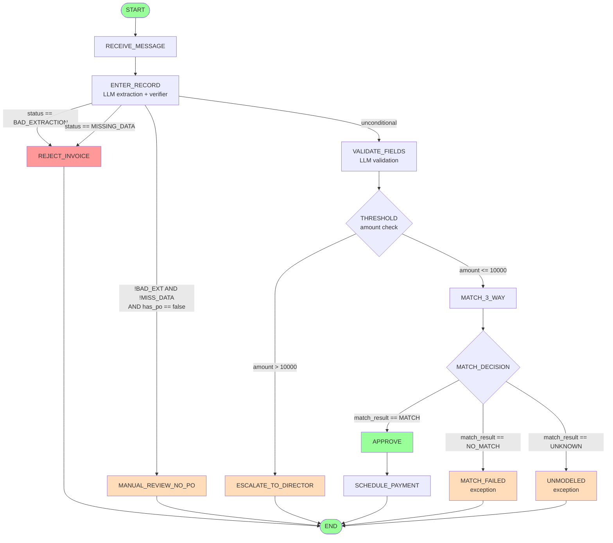

# Architecture

## Overview

The system processes raw AP invoices through a deterministic pipeline: a mined
process graph is patched, normalized, linted, compiled to a LangGraph state
machine, and executed. LLM calls are constrained to specific node types
(see `src/agent/nodes.py: execute_node`); all routing decisions are made by
the condition DSL and the 2-phase router.

```
Raw Graph JSON                     ──> patch_logic.py (inject guardrails)
  outputs/ap_master_manual_auto.json       │
                                           ▼
                                    normalize_graph.py (15 idempotent passes)
                                           │
                                           ▼
Patched + Normalized Graph         ──> compiler.py (build_ap_graph)
  outputs/ap_master_manual_auto_patched.json
                                           │
                                    assert_graph_valid() ← linter + invariants
                                           │
                                           ▼
                                    LangGraph CompiledGraph
                                           │
                                    APState flows through nodes
                                           │
                                           ▼
                                    Terminal APState (status, audit_log, provenance)
```

---

## Pipeline Flow (Mermaid)

Node IDs and conditions below are verified against
`outputs/ap_master_manual_auto_patched.json`.



---

## Subsystems

### 1. Normalization Passes

**File**: `src/normalize_graph.py`

Transforms a raw extracted graph into a valid, lintable form through idempotent
passes. Each pass has signature `(data: dict) -> tuple[dict, list[str]]` and
returns the repaired graph plus a changelog. The passes are:

| # | Function | Purpose |
|---|----------|---------|
| 1 | `fix_artifact_references` | Ensure `art_account_code` artifact exists |
| 2 | `fix_canonical_key_duplicates` | Suffix duplicate `canonical_key` with `@node_id` |
| 3 | `normalize_edge_conditions` | Legacy labels -> canonical DSL via synonym map |
| 4 | `inject_exception_nodes` | Add `n_no_match` and `n_manual_review_gate` sinks |
| 5 | `fix_match3way_gateway` | n4 fan-out -> 2 exclusive branches |
| 6 | `fix_secondary_match_gateways` | Convert secondary match gateways to task+decision pairs |
| 7 | `fix_main_execution_path` | Wire n7 -> end node (not n8) |
| 8 | `fix_haspo_gateway` | n8 fan-out -> `has_po==true`/`false` branches + sequential chain |
| 9 | `fix_placeholder_gateways` | Resolve IF_CONDITION and SCHEDULE_PAYMENT edges |
| 10 | `convert_unparseable_gateways_to_station` | Catch-all: unparseable conditions -> exception station |
| 11 | `convert_whitelisted_fanout_to_sequential` | HAS_PO / APPROVE_OR_REJECT fan-out -> sequential chain |
| 12 | `convert_fanout_gateways_to_ambiguous_station` | Catch-all: remaining fan-out -> ambiguous station |
| 13 | `wire_bad_extraction_route` | n3 -> n_reject on `status == "BAD_EXTRACTION"` |
| 14 | `inject_match_result_unknown_guardrail` | UNKNOWN guardrail edges on match_result gateways |
| 15 | `deduplicate_edges` / `deduplicate_edges_strict` | Remove identical (frm, to, condition) triples |

**Contract**: Every pass is idempotent. Running the full pipeline twice produces
identical output. `normalize_all(data)` orchestrates all passes.

---

### 2. Condition DSL

**File**: `src/conditions.py`

A safe, eval-free condition language for routing. No `eval()`, no `exec()`, no
arbitrary Python code.

**Grammar** (from the module docstring):

```
condition      := comparison (AND comparison)*
comparison     := identifier op literal
AND            := "AND" (case-insensitive keyword)
op             := == | != | > | >= | < | <=
literal        := number | bool_literal | string_literal
bool_literal   := true | false
string_literal := '"' chars '"'
number         := [-]int | [-]float
identifier     := [a-zA-Z_][a-zA-Z0-9_]*
```

**AST types** (dataclasses):

- `Comparison(left: str, op: str, right: Any)` -- single comparison
- `Conjunction(children: tuple[Comparison, ...])` -- AND-chain (always flat)

**Public API**:

| Function | Signature | Purpose |
|----------|-----------|---------|
| `normalize_condition` | `(raw: str \| None) -> str \| None` | Legacy synonyms + inline expressions -> canonical DSL |
| `parse_condition` | `(expr: str) -> ConditionAST` | Tokenize + parse -> AST (raises `ConditionParseError`) |
| `compile_condition` | `(expr: str) -> Callable[[dict], bool]` | AST -> predicate function |
| `get_predicate` | `(raw: str \| None) -> Callable[[dict], bool] \| None` | normalize + compile + cache |

The synonym map handles 30+ legacy labels (e.g. `"HAS_PO"` -> `"has_po == true"`,
`"approve"` -> `"amount <= 5000"`).

---

### 3. Router

**File**: `src/agent/router.py`

Deterministic 2-phase edge router. The core `analyze_routing()` function is
pure (no side effects); `route_edge()` wraps it with exception station resolution.

**`RouteResult`** dataclass:

```python
@dataclass
class RouteResult:
    selected: str | None     # target node or None
    reason: str              # one of: single_edge, all_same_target,
                             #   condition_match, unconditional_fallback,
                             #   ambiguous_route, no_route
    candidates: list[dict]   # [{"to": str, "condition": str|None, "matched": bool|None}]
```

**Evaluation phases**:

1. **Trivial short-circuits**: single outgoing edge, or all edges lead to same
   target -> route immediately.
2. **Phase 1 -- Conditional edges** (`condition != None`): evaluate all conditions
   via DSL predicates. Exactly 1 match -> route. Multiple matches ->
   `AMBIGUOUS_ROUTE`. Zero matches -> proceed to Phase 2.
3. **Phase 2 -- Unconditional fallback** (`condition == None`): exactly 1
   unconditional -> route. Multiple -> `AMBIGUOUS_ROUTE`. Zero -> `NO_ROUTE`.

**Exception stations** (fail-closed sinks):

| Intent Key | Node ID | Terminal Status |
|------------|---------|-----------------|
| `task:MANUAL_REVIEW_BAD_EXTRACTION` | `n_exc_bad_extraction` | `EXCEPTION_BAD_EXTRACTION` |
| `task:MANUAL_REVIEW_UNMODELED_GATE` | `n_exc_unmodeled_gate` | `EXCEPTION_UNMODELED` |
| `task:MANUAL_REVIEW_AMBIGUOUS_ROUTE` | `n_exc_ambiguous_route` | `EXCEPTION_AMBIGUOUS` |
| `task:MANUAL_REVIEW_NO_ROUTE` | `n_exc_no_route` | `EXCEPTION_NO_ROUTE` |

---

### 4. Verifier

**File**: `src/verifier.py`

Deterministic post-extraction validation. Cross-checks LLM evidence against
raw invoice text.

**`verify_extraction(raw_text, extraction) -> (bool, list[FailureCode], dict)`**

**Failure codes** (`FailureCode` literal type, 24 codes):

| Code | Meaning |
|------|---------|
| `EVIDENCE_NOT_FOUND` | Evidence substring not in normalized raw text |
| `MISSING_EVIDENCE` | Evidence field empty/null |
| `AMOUNT_MISMATCH` | Parsed amount != claimed amount (delta > 0.01) |
| `AMBIGUOUS_AMOUNT_EVIDENCE` | Multiple numbers in evidence, cannot disambiguate |
| `MISSING_VENDOR` | Vendor value empty/null |
| `VENDOR_EVIDENCE_MISMATCH` | Vendor value not contained in evidence |
| `PO_PATTERN_MISSING` | has_po=true but no PO pattern in evidence |
| `MISSING_KEY` | Required field missing from extraction dict |
| `WRONG_TYPE` | Field value has incorrect type |
| `DATE_MISSING_KEY` | invoice_date field missing required sub-key |
| `DATE_WRONG_TYPE` | invoice_date value has incorrect type |
| `DATE_EVIDENCE_NOT_FOUND` | Date evidence not grounded in raw text |
| `DATE_PARSE_FAILED` | Date value cannot be parsed |
| `DATE_AMBIGUOUS` | Multiple plausible dates in evidence |
| `DATE_VALUE_MISMATCH` | Parsed date != claimed date |
| `TAX_MISSING_KEY` | tax_amount field missing required sub-key |
| `TAX_WRONG_TYPE` | tax_amount value has incorrect type |
| `TAX_EVIDENCE_NOT_FOUND` | Tax evidence not grounded in raw text |
| `TAX_MISSING_EVIDENCE` | Tax evidence field empty/null |
| `TAX_PARSE_FAILED` | Tax value cannot be parsed from evidence |
| `TAX_ANCHOR_MISSING` | No tax keyword anchor in evidence |
| `TAX_AMBIGUOUS_EVIDENCE` | Multiple plausible tax amounts in evidence |
| `TAX_AMOUNT_MISMATCH` | Parsed tax != claimed tax (delta > 0.01) |
| `ARITH_TOTAL_MISMATCH` | Source-text subtotal+tax+fees != total |
| `ARITH_TAX_RATE_MISMATCH` | Source-text rate*subtotal != tax |

**Per-field verification** (5 fields, 3 required + 2 optional):

- **Vendor** (required): value non-empty, evidence grounded in raw text, vendor
  name appears in evidence.
- **Amount** (required): value numeric, evidence grounded, all numbers extracted
  from evidence via regex. If multiple: disambiguate using 30-char keyword window
  (`"total"`, `"amount due"`, `"balance due"`, `"sum"`). Verify
  `abs(parsed - claimed) <= 0.01`.
- **has_po** (required): value is bool, evidence grounded. If `true`: evidence
  must match PO regex `\b(PO|Purchase\s+Order)\b|\bP\.O\.(?:\s|$|#)|PO-?\d+`.
- **invoice_date** (optional): value is date string, evidence grounded.
  Normalizes common formats (ISO, slash-delimited). Skipped when absent from
  extraction dict.
- **tax_amount** (optional): value numeric, evidence grounded. Tax keyword
  anchor required. Disambiguates via keyword proximity. Skipped when absent
  from extraction dict.

**Verifier registry** (`src/verifier_registry.py`): registry-backed field
validation. Each field has a `FieldValidatorSpec` with `optional` flag.
Optional fields are skipped when not present in the extraction dict.

**Evidence quality tiers** (`MatchTier`): each field verifier classifies match
quality as `exact_match`, `normalized_match`, or `not_found`. Tiers propagate
through provenance and verifier summary audit events.

**Text normalization**: `_normalize_text(s)` collapses whitespace, strips, and
casefolds before all substring comparisons.

---

### 5. Linter + Invariants

**Files**: `src/linter.py`, `src/invariants.py`

**Public API**:

- `lint_process_graph(graph) -> list[LintError]` -- full validation sweep
- `assert_graph_valid(graph) -> None` -- raises `ValueError` if any
  error-severity issues found (called by `build_ap_graph()` before compilation)

**LintError codes** include:

- `E_NODE_ID_DUP`, `E_EDGE_REF`, `E_CANONICAL_KEY_MISSING`,
  `E_CANONICAL_KEY_DUP`, `E_EDGE_DUP` (referential integrity)
- `E_GATEWAY_TOO_FEW_EDGES`, `E_GATEWAY_NULL_CONDITION`,
  `E_GATEWAY_FANOUT_SAME_CONDITION`, `E_CONDITION_PARSE` (gateway semantics)
- `E_MATCH_SPLIT_MISSING_DECISION`, `E_MATCH_SPLIT_BAD_TASK_TO_GATE`,
  `E_MATCH_SPLIT_NON_EXHAUSTIVE` (match-split invariants)
- `E_PLACEHOLDER_CONDITION`, `E_MATCH_RESULT_FOREIGN_WRITER`,
  `E_MATCH_RESULT_WRONG_ROUTER`, `E_MATCH_DECISION_TRUTH_TABLE`,
  `E_SYNTHETIC_INCOMPLETE` (advanced invariants)

**Invariant check functions** (in `src/invariants.py`):

| Function | What it checks |
|----------|----------------|
| `check_match_split_invariants` | Every MATCH_3_WAY task has a corresponding MATCH_DECISION gateway |
| `check_no_placeholder_conditions` | No legacy placeholder strings survive normalization |
| `check_match_result_ownership` | Only MATCH_3_WAY may write match_result |
| `check_match_result_routing` | Only MATCH_DECISION gateways may route on match_result |
| `check_match_decision_truth_table` | MATCH_DECISION has exactly 3 exhaustive branches |
| `check_synthetic_completeness` | All synthetic nodes have `semantic_assumption` + `origin_pass` |

---

### 6. Patching System

**File**: `patch_logic.py`

Injects missing business-logic guardrails into the extracted graph before
normalization.

| Patch | What it does |
|-------|--------------|
| **PATCH 0** | Ensures `art_account_code` artifact exists |
| **PATCH 1** (`patch_1_threshold_gateway`) | Injects `n_threshold` gateway: amounts > $10,000 -> `n_escalate` (ESCALATE_TO_DIRECTOR), amounts <= $10,000 -> continue |
| **PATCH 2** (`patch_2_data_loophole`) | Guards n3 outgoing edges: `status == "MISSING_DATA"` -> `n_reject`, compound AND condition for `has_po == false` -> `n_exception` |

**Exception stations** (4 fail-closed sinks):
`n_exc_bad_extraction`, `n_exc_unmodeled_gate`, `n_exc_ambiguous_route`,
`n_exc_no_route`

**Metadata convention**: every injected node carries
`meta.origin = "patch"`, `meta.patch_id`, `meta.rationale`.

---

### 7. Fail-Closed Behavior

The system is designed to never silently guess when routing is ambiguous:

1. **Linter blocks compilation**: `assert_graph_valid()` in
   `src/agent/compiler.py: build_ap_graph` raises `ValueError` on any
   error-severity lint issue before the graph is compiled.
2. **Router fails closed**: when multiple conditional edges match ->
   `AMBIGUOUS_ROUTE` -> exception station. When no edges match at all ->
   `NO_ROUTE` -> exception station.
3. **Unparseable gateways**: `convert_unparseable_gateways_to_station()` in
   `src/normalize_graph.py` reroutes gateways with conditions that cannot be
   normalized to a `MANUAL_REVIEW_UNMODELED_GATE` exception station.
4. **Verifier rejects bad extraction**: if `verify_extraction()` fails,
   the node sets `status = "BAD_EXTRACTION"` and the routing edge
   `n3 -> n_reject` fires.

---

### 8. State Schema

**File**: `src/agent/state.py`

```python
class APState(TypedDict):
    invoice_id:     str
    vendor:         str
    amount:         float
    has_po:         bool
    invoice_date:   str       # optional field — promoted only on successful verification
    tax_amount:     float     # optional field — promoted only on successful verification
    po_match:       bool
    match_3_way:    bool
    match_result:   str       # "MATCH" | "NO_MATCH" | "VARIANCE" | "UNKNOWN"
    status:         str       # StatusType literal
    current_node:   str
    last_gateway:   str
    audit_log:      Annotated[list[str], operator.add]  # accumulates per step
    route_records:  Annotated[list[dict], operator.add]  # structured RouteRecord dicts
    raw_text:       str
    extraction:     dict      # LLM payload: {field: {value, evidence}, ...}
    provenance:     dict      # verifier metadata per field
    retry_count:    int       # critic retry attempts executed
    failure_codes:  list[str] # verifier failure codes from most recent attempt
```

**Factory**: `make_initial_state(invoice_id, raw_text, po_match=False, match_3_way=None)`
creates a state dict with safe defaults from `DEFAULT_STATE_TEMPLATE`.

**`audit_log`** uses `Annotated[list, operator.add]` so LangGraph merges
(not replaces) audit entries across steps.

**Optional field promotion**: `invoice_date` and `tax_amount` are only promoted
to state inside `if valid:` blocks, preserving the invariant that optional fields
are only populated on successful verification. When absent or verification fails,
they retain their defaults (`""` and `0.0`).
