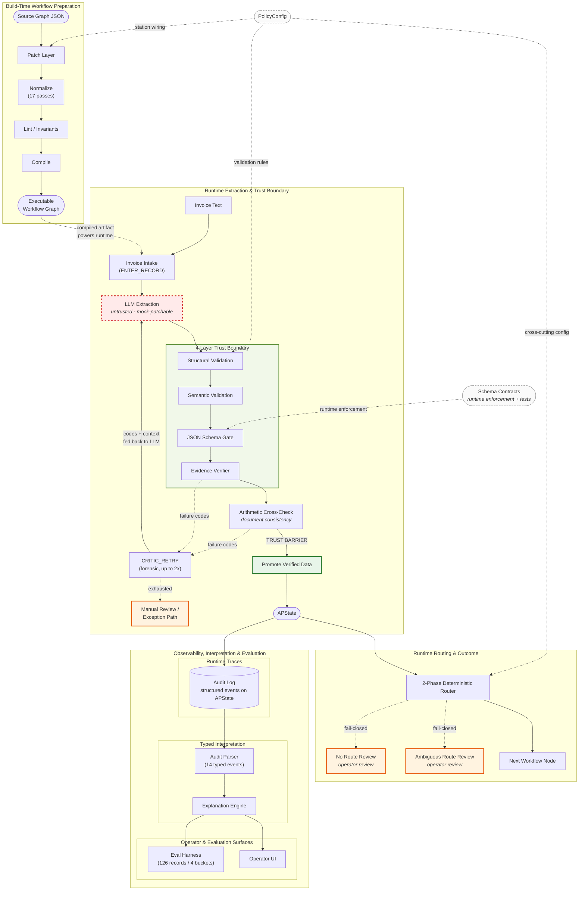

# Deterministic AI Workflow Architecture — Technical Detail

> Detailed trust-boundary and runtime diagram.
> For a scannable overview, see [ARCHITECTURE_OVERVIEW.md](ARCHITECTURE_OVERVIEW.md).
> For module-level documentation, see [ARCHITECTURE.md](ARCHITECTURE.md).

## Reading the Diagram

| Visual cue | Meaning |
|-----------|---------|
| Red dashed border | Untrusted AI output (LLM extraction) |
| Green subgraph | 4-layer trust boundary — deterministic validation stack |
| Green node | Trust barrier — only verified data crosses into state |
| Orange nodes | Fail-closed exits — always route to operator review, never silently drop |
| Dashed arrows | Failure paths, cross-cutting influences, or conceptual links |
| "TRUST BARRIER" edge | The hard boundary between untrusted extraction and trusted state |

## Design Decisions

- **Arithmetic is adjacent to, not inside, the trust boundary.** The 4-layer boundary validates extraction output (is the data correct?). Arithmetic validates the source document (do the numbers add up?). These are conceptually different checks.
- **CRITIC_RETRY re-enters the full pipeline.** Failure codes from any validation step are fed back to the LLM. The retry is forensic — it doesn't skip validation, it repeats it entirely.
- **Eval exercises the full deterministic stack.** The LLM box is mock-patchable — eval replaces only the AI, the entire validation + routing pipeline runs unchanged.
- **PolicyConfig is a cross-cutting sidecar.** It influences build-time patching, runtime validation, and routing decisions, but is not on the main data path.
