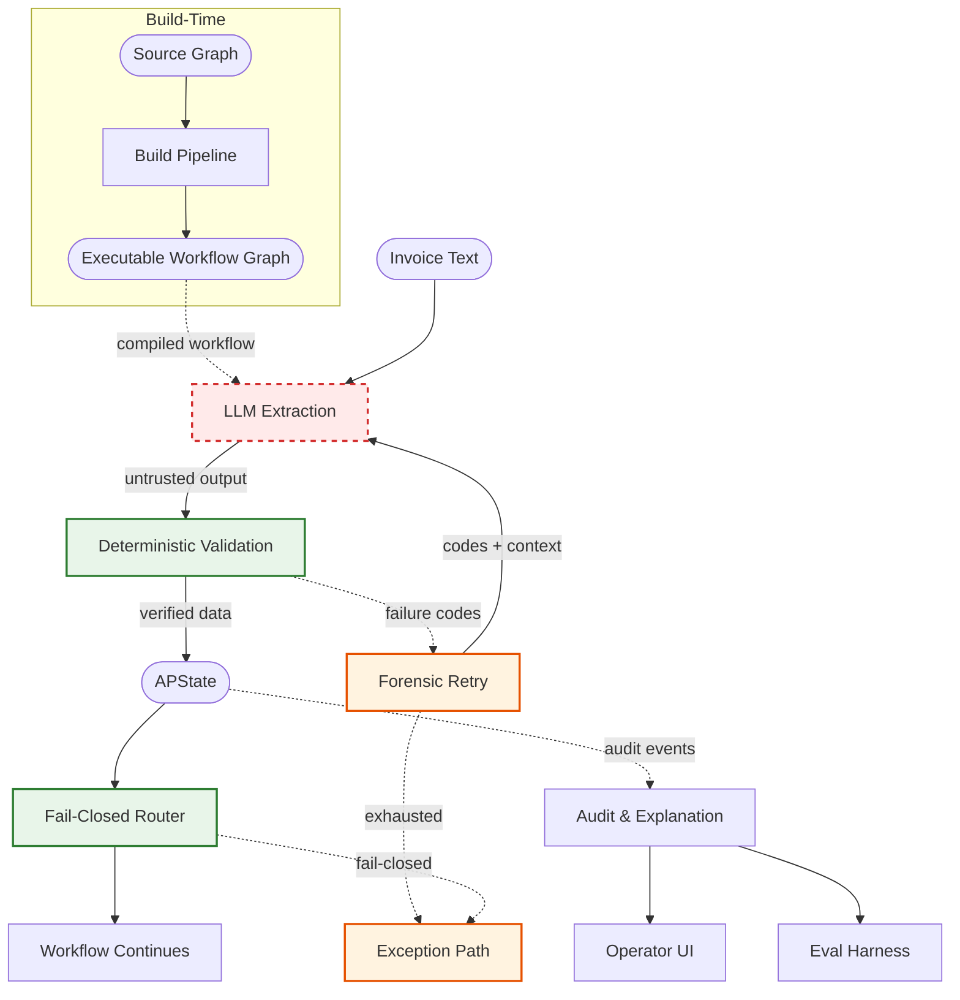

# Architecture Overview

> Scannable overview of the deterministic AI workflow for invoice processing.
> For the detailed technical view, see [ARCHITECTURE_DIAGRAM.md](ARCHITECTURE_DIAGRAM.md).
> For module-level documentation, see [ARCHITECTURE.md](ARCHITECTURE.md).

## Reading the Diagram

| Visual cue | Meaning |
|------------|---------|
| Red dashed border | Untrusted AI output |
| Green border | Deterministic control (validation, routing) |
| Orange border | Failure handling (retry, fail-closed exits) |
| Stadium shapes | External inputs or data stores |
| Dashed arrows | Failure paths, artifact/runtime links, or observability flows |

Cross-cutting concerns (PolicyConfig, Schema Contracts) and internal validation steps (structural, semantic, schema gate, evidence verifier, arithmetic) are detailed in the [technical diagram](ARCHITECTURE_DIAGRAM.md).
